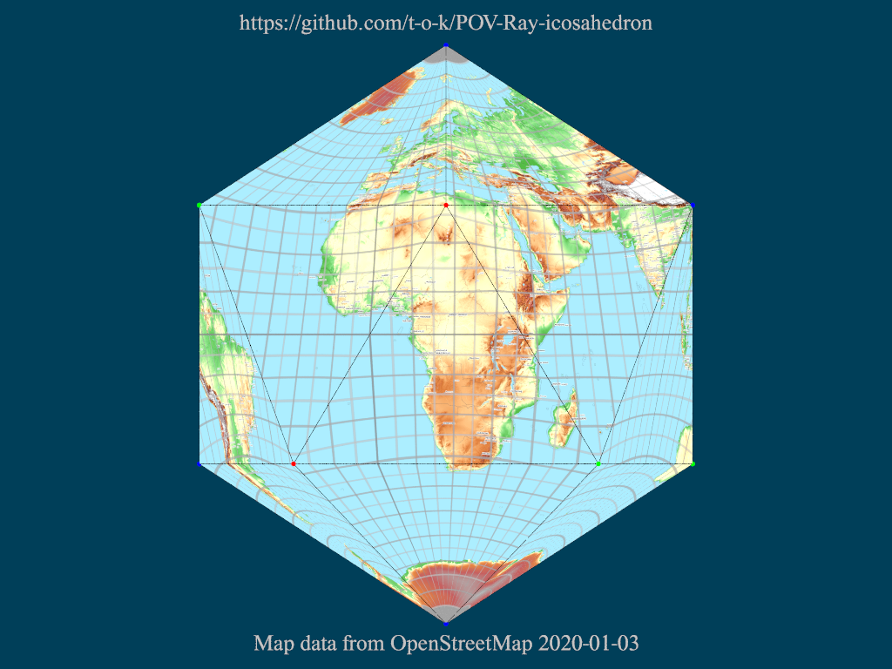
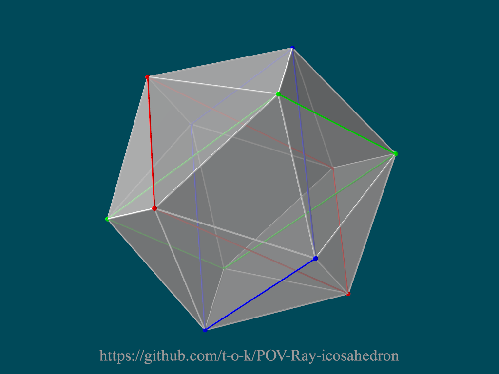
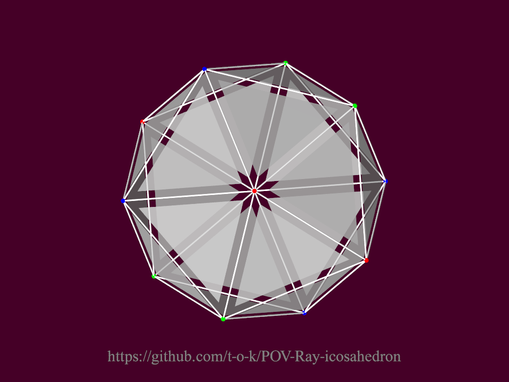
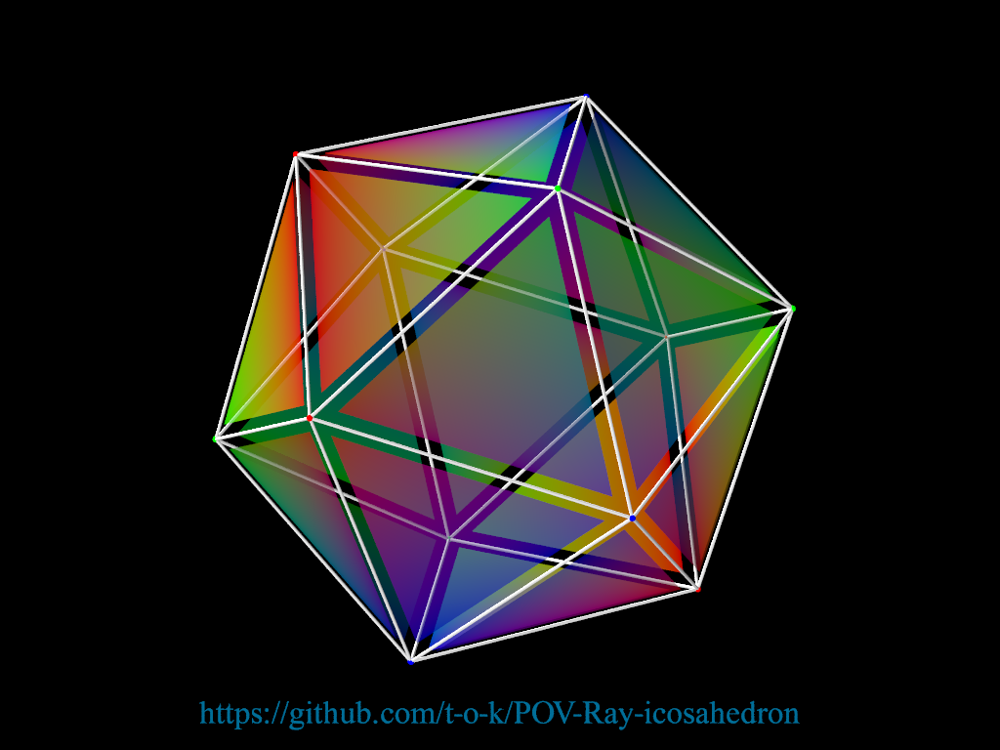
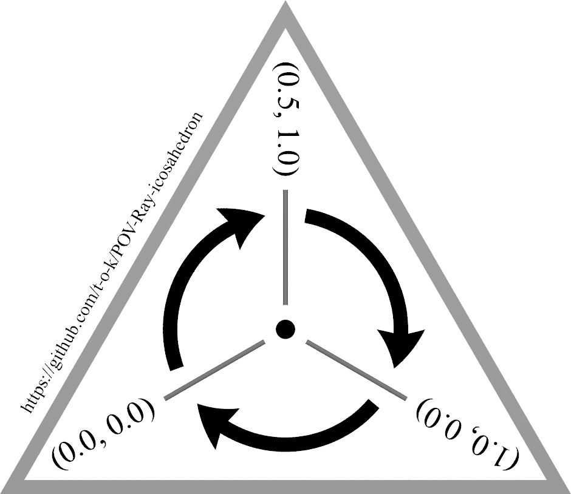
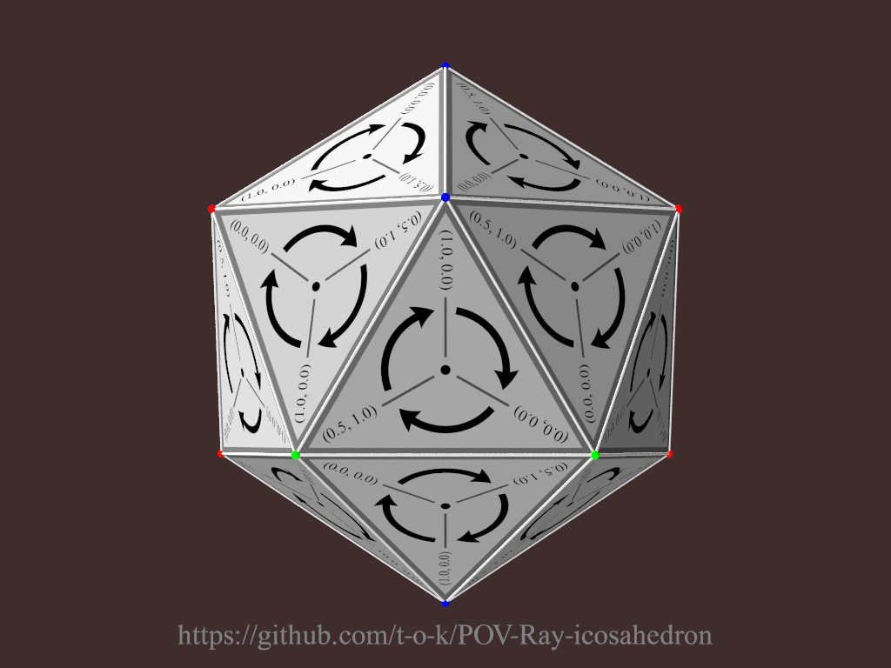

# POV-Ray-icosahedron
POV-Ray scene files for rendering convex regular icosahedrons

[Source code](Icosahedron_Mesh2_With_World_Map.pov)\

[Source code](Icosahedron_With_Internal_Rectangles.pov)\

[Source code](Icosahedron.pov)\

[Source code](Icosahedron_Coloured.pov)\

[Source code](Triangle_Arrows_Clockwise.pov)\

[Source code](Icosahedron_Vertex_Order_Check.pov)\

